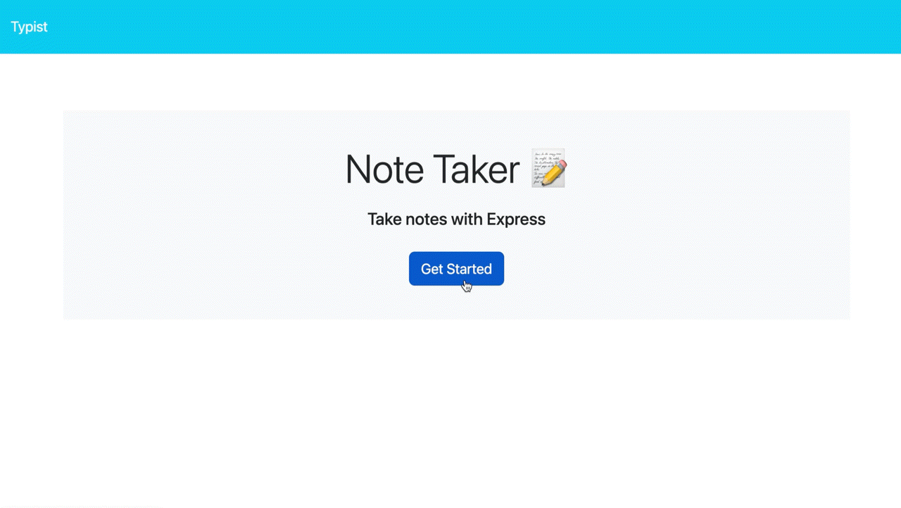

  

<h1 align="center">Typist</h3>

<i>Your own personal note-taker! Type away!</i>

  

 
 

## **ABOUT THE PROJECT**
### **Overview**
Record from tasks to thoughts, or even groceries!

With a clean, distraction-free interface, ***Typist*** makes it easy to capture, organize, and access your notes effortlessly. Whether you're jotting down quick ideas or drafting detailed documents.

*Find the repo [here](https://github.com/Rod-Freedom/C11-Typist).* 
*Go to the site [here](https://typist-j7vq.onrender.com)!*

 
 

## Table of Contents
- [License](#license)
- [Resources](#resources)
- [Get Started](#get-started)
- [Usage](#usage)
- [Demos](#demos)
- [Testing](#testing)
- [Contribute](#contribute)
- [Credits](#credits)

 

[(Back to the Top)](#about-the-project)

## Resources
* For JavaScript
    * ES6 modules.
    * Promises.
    * Extensive object and array destructuring.
    * Classes and constructors.
    * Methods for classes.
* For Node
    * express.js
        * Routers.
        * Static assets.
        * `app.use(urlencoded({ extended: true }))` to parse urlencoded data.
        * `app.use(json())` to parse JSON data.
        * `app.use('/api', api)` to use api routes.

    * fs module
        * Synchronous methods.
            * `readFileSync()` and `writeFileSync()` to save and read data from the JSON db.
    

 

[(Back to the Top)](#about-the-project)

## Get Started
No installation is required, just go to the site [here](https://typist-j7vq.onrender.com) and explore Typist!

 

[(Back to the Top)](#about-the-project)

## Usage
**Typist** is easy and intuitive to use.

Once you've entered the site, click `Get Started` and you'll be redirected to the notes page.

On the left, you'll see the saved notes; you can click on any of them to see their content.

To save new notes, fill in the blanks or click the `New Note` button; once you have filled in the title and content, click `Save Note`.

To delete any of them, click on the trash can.

> 

 

[(Back to the Top)](#about-the-project)

## License
 
See the [license](https://github.com/Rod-Freedom/C11-Typist/blob/main/LICENSE) for more details.

 

[(Back to the Top)](#about-the-project)

## Contribute
If you have suggestions or want to help with some improvements, you can write me by [email](mailto:rod@alpacaazul.mx).

 

[(Back to the Top)](#about-the-project)

## Credits
All the back-end code was created from scratch by [Rod's Freedom](https://github.com/Rod-Freedom).

 

[(Back to the Top)](#about-the-project)